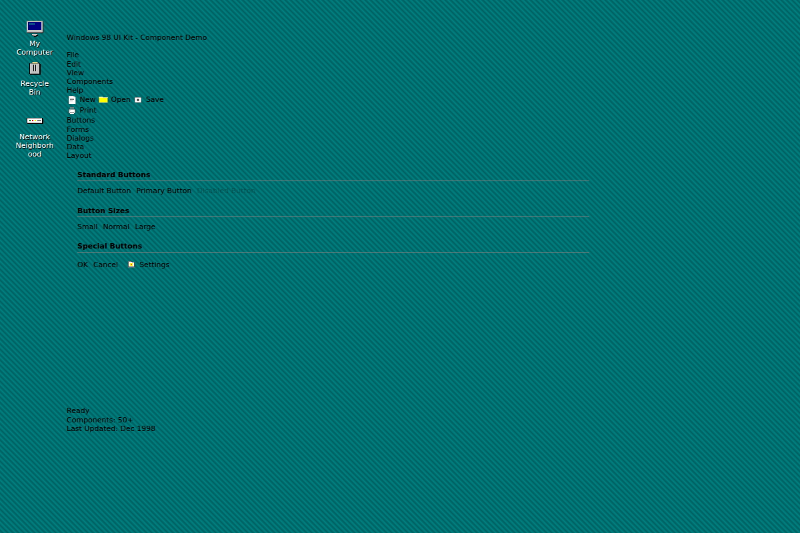

# Windows 98 UI Kit



<div align="center">

[](LICENSE)
[](https://www.w3.org/Style/CSS/)
[](https://html.spec.whatwg.org/)
[](https://en.wikipedia.org/wiki/Windows_98)

</div>

A comprehensive HTML/CSS UI kit that faithfully recreates the iconic Windows 98 aesthetic. Build nostalgic web applications with authentic retro styling and pixel-perfect components.

## ✨ Features

- **32+ Authentic Components** - Complete set of Windows 98 UI elements
- **Pixel-Perfect Design** - Meticulously recreated visual elements
- **Pure CSS Implementation** - No JavaScript dependencies required
- **Modular Architecture** - Use individual components or the complete kit
- **Comprehensive Icon Library** - 500+ classic Windows 98 icons included
- **Cross-Browser Compatible** - Works in all modern browsers
- **Responsive Design** - Adapts to different screen sizes while maintaining authenticity

## 🚀 Quick Start

### Installation

Clone the repository or download the CSS files:

```bash
git clone https://github.com/yourusername/windows-98-ui-kit.git
cd windows-98-ui-kit
```

### Basic Usage

Include the main CSS file in your HTML:

```html
<link rel="stylesheet" href="dist/windows-98-ui-kit.css">
```

Or include individual components:

```html
<link rel="stylesheet" href="src/styles/base/variables.css">
<link rel="stylesheet" href="src/styles/components/window.css">
<link rel="stylesheet" href="src/styles/components/button.css">
```

### Simple Window Example

```html
<div class="win98-window" style="width: 400px; height: 300px;">
  <div class="win98-titlebar">
    <div class="win98-titlebar__icon">📄</div>
    <div class="win98-titlebar__title">My Application</div>
    <div class="win98-titlebar__controls">
      <button class="win98-window-control win98-window-control--minimize">_</button>
      <button class="win98-window-control win98-window-control--maximize">□</button>
      <button class="win98-window-control win98-window-control--close">×</button>
    </div>
  </div>
  <div class="win98-window__content">
    <p>Hello, Windows 98!</p>
    <button class="win98-button">OK</button>
  </div>
</div>
```

## 📚 Components

### Windows & Layout
- **Windows** - Resizable windows with titlebar and controls
- **Dialogs** - Modal dialogs and message boxes
- **Panels** - Raised and sunken content containers
- **Splitters** - Resizable panel dividers
- **Tabs** - Multi-page tab controls
- **Property Sheets** - Settings and configuration layouts

### Navigation & Menus
- **Menubar** - Application menu system
- **Dropdown Menus** - Cascading menu items
- **Context Menus** - Right-click menus
- **Toolbar** - Icon-based action bars
- **Statusbar** - Bottom status information display

### Form Controls
- **Buttons** - Various button styles and states
- **Text Inputs** - Single-line text fields
- **Textarea** - Multi-line text areas
- **Select Boxes** - Dropdown selection controls
- **Checkboxes** - Binary choice controls
- **Radio Buttons** - Single selection from groups

### Data Display
- **List View** - File explorer-style lists
- **Tree View** - Hierarchical data display
- **Tables** - Tabular data with sorting
- **Progress Bars** - Task completion indicators
- **Scroll Containers** - Custom scrollbar styling

### Special Elements
- **Icons** - 500+ classic Windows 98 icons
- **Loading States** - Hourglass and spinner animations
- **Busy Overlays** - Modal loading indicators
- **Cursors** - Authentic Windows 98 cursor styles
- **Desktop Elements** - Taskbar and desktop styling

## 🎨 Customization

### CSS Variables

The kit uses CSS custom properties for easy theming:

```css
:root {
  --win98-control-face: #c0c0c0;
  --win98-control-light: #dfdfdf;
  --win98-control-dark: #808080;
  --win98-control-dark-dark: #404040;
  --win98-window-background: #ffffff;
  --win98-window-text: #000000;
  --win98-font-family: 'MS Sans Serif', sans-serif;
  --win98-font-size-normal: 11px;
}
```

### Component Modifiers

Most components support modifier classes for different states:

```html
<!-- Button variants -->
<button class="win98-button">Default</button>
<button class="win98-button win98-button--pressed">Pressed</button>
<button class="win98-button win98-button--default">Default Action</button>

<!-- Window sizes -->
<div class="win98-window win98-window--small">Small Window</div>
<div class="win98-window win98-window--large">Large Window</div>
```

## 📖 Documentation

- [Component Reference](docs/component-reference.md) - Detailed API for all components
- [Design Specifications](docs/design-specifications.md) - Visual design guidelines
- [Developer Guide](docs/developer-guide.md) - Advanced usage and customization
- [Icon Guide](docs/icons-guide.md) - Complete icon reference

## 🛠️ Development

### Prerequisites

- Node.js 16+ (for build tools)
- Modern web browser

### Setup

```bash
# Install dependencies
npm install

# Start development server
npm run dev

# Build for production
npm run build

# Run linting
npm run lint
```

### Project Structure

```
windows-98-ui-kit/
├── src/
│   └── styles/
│       ├── base/           # Core variables and resets
│       ├── components/     # Individual component styles
│       └── utilities/      # Helper classes
├── examples/               # Demo HTML files
├── docs/                  # Documentation
├── assets/                # Icons and images
└── dist/                  # Built CSS files
```

## 🎯 Browser Support

| Browser | Version | Notes |
|---------|---------|-------|
| Chrome | 60+ | Full support |
| Firefox | 60+ | Full support |
| Safari | 12+ | Full support |
| Edge | 79+ | Full support |
| IE | 11 | Limited support |

## 🤝 Contributing

Contributions are welcome! Please see our [Contributing Guide](CONTRIBUTING.md) for details.

1. Fork the repository
2. Create a feature branch (`git checkout -b feature/amazing-component`)
3. Commit your changes (`git commit -m 'Add amazing component'`)
4. Push to the branch (`git push origin feature/amazing-component`)
5. Open a Pull Request

## 📄 License

This project is licensed under the MIT License - see the [LICENSE](LICENSE) file for details.

## 🙏 Acknowledgments

- Microsoft for creating the iconic Windows 98 design language
- The retro computing community for preserving 90s aesthetics
- [Win98Icons.alexmeub.com](https://win98icons.alexmeub.com/) for the comprehensive icon collection

## 🔗 Related Projects

- [98.css](https://jdan.github.io/98.css/) - Another Windows 98 CSS framework
- [XP.css](https://botoxparty.github.io/XP.css/) - Windows XP styling
- [7.css](https://khang-nd.github.io/7.css/) - Windows 7 components

---

<div align="center">
  <strong>✨ Bringing the 90s back to the web, one pixel at a time ✨</strong>
</div>
